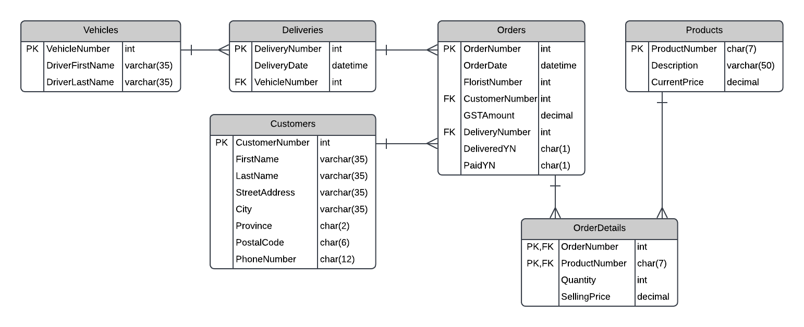

# DMIT-1508 | Quiz 2 | Nov 2022

Place your answers in the [accompanying SQL file](./Quiz-2.sql). The [ERD](#funky-flowers-erd) for this database is at the end of this document.

> **Funky Flowers** - *Free Delivery for Weddings and Funerals*

## (4 Marks) | PART A - Constraints

Add the following constraints to the existing create table definitions (do **NOT** use the `ALTER TABLE` statement for your answer).

If you are having difficulties executing the insert script with your constraints, comment out your constraint(s) and continue with the rest of the quiz, or consider doing this question last so it does not interfere with the creation of the tables and inserting the test data. 

| Table        | Column(s)  | Default   | Check  |
|--------------|------------|-----------|--------|
| Orders       | OrderDate  | GetDate() |        |
| Orders       | PaidYN     | N         |        |
| OrderDetails | Quantity   |           | >= 0   |
| Customers    | PostalCode |           | Z9Z9Z9 |

- `Z` means any upper-case character from A to Z
- `9` means any digit from 0 to 9

## (1 Mark) | PART B - Indexes

Create non clustered indexes on the foreign keys in the OrderDetails table.

## (2 Marks) | PART C - Alter

Assuming the tables all have data in them already, use the Alter Table statement to add a column PrepaidCollect to the Deliveries table. The column will be one character, will be optional when inserting data, and the only valid values will be `'P'` (Prepaid) or `'C'` Collect.

## (14 Marks) | PART D – Queries

Execute the Quiz2.sql script to create and populate your tables. You will then
be able to test and debug your queries. You may wish to add/update/delete data
in the script to fully test your queries.

Use only the information you are given, do not hard-code values unless given.

1. (2 Marks) List the order number, customer number, order date and GST amount for all the orders that were paid for but not delivered.

2. (3 Marks) We want to know which products sell the most. Select the sum of the quantities sold for each product where the sum is greater than 50. Show the product description and the total quantity ordered.

3. (2 Marks) A September delivery schedule is needed. Select the driver's full name (as one column), vehicle number and delivery number for all orders in September of the current year (do not hard code the current year).

4. (4 Marks) We are anticipating a drop in the GST by the federal government. To understand the impact of such a drop, write a query showing totals for each order; only include orders containing the product number `1701`. Return the order number, the "Current GST" (the sum of `selling price X quantity X 5%`), and the "Proposed GST" (the sum of `selling price X quantity X 4%`).

5. (3 Marks) We would like to know which city the majority of our northern Alberta customers are from. List the city and the total number of customers who placed an order from that city with postal codes starting with T5 to T9. List the cities alphabetically.

## (4 Marks) | PART E – Views

1. (2 Marks) Create a view called ProductOrders that contains ProductNumber, Description, CurrentPrice, OrderNumber, Quantity and SellingPrice for **all** products.

2. (2 Marks) Using the view ProductOrders, select the Description and the average SellingPrice for each product that has an order.

## (4 Marks) | PART F – DML

1. (2 marks) Decrease the CurrentPrice of all products by 15% that have a Description that starts with `C`.

2. (2 Marks) Delete all customers who do not have any orders.

----

## Funky Flowers ERD

----

&copy; 2022 - **All Rights Reserved** - Northern Alberta Institute of Technology - DMIT

No permission to repoduce without explicit written consent of the Northern Alberta Institute of Technology
