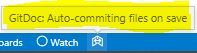
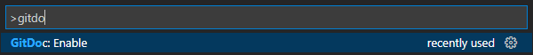

# 2022 Sep - Quiz 2

> **Renier Minnaar**

| **Part**  | **Possible Marks** | **Marks Earned** |
|-----------|--------------------|------------------|
| **A**     | 4.0                |                  |
| **B**     | 1.0                |                  |
| **C**     | 2.0                |                  |
| **D**     | 14.0               |                  |
| **E**     | 4.0                |                  |
| **F**     | 4.0                |                  |
| **Total** | **29.0**           |                  |

----


**Read all the instructions before beginning your work!**

Perform all your work directly inside this repository; **do not copy or move anything from this repository to another location**.

**Place your answers in the existing [Quiz-2.sql](./Quiz-2.sql) script file**. The specs are in the [PDF document](./Specs.pdf) that is part of this repository.

----

## Automatic Commits

**NOTE:** *GitDoc* has been enabled for this repository; *do not turn this off*.

Ensure that git knows your username and email. You can find out if it is configured on your computer by running the following commands in the terminal.

```shell
git config user.name
git config user.email
```

If there is no information on your user name or email in the git configuration, run the following code, replacing the username and email information with your personal information.

```shell
git config user.name "Your Full Name"
git config user.email "YourSchoolEmail@nait.ca"
```

Also, ensure that GitDoc is running. In the status bar of VS Code, you should see the icon that indicates GitDoc is running. .



To enable GitDoc, press <kbd>F1</kbd> and type `GitDoc: Enable`.


